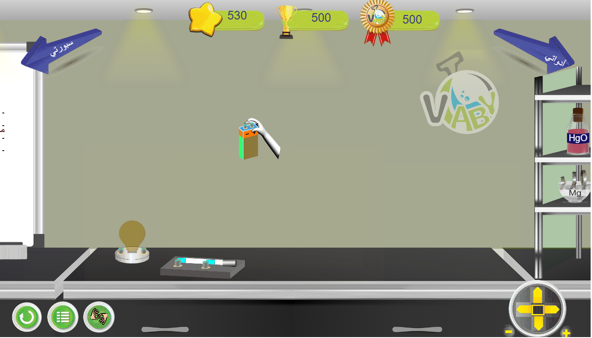
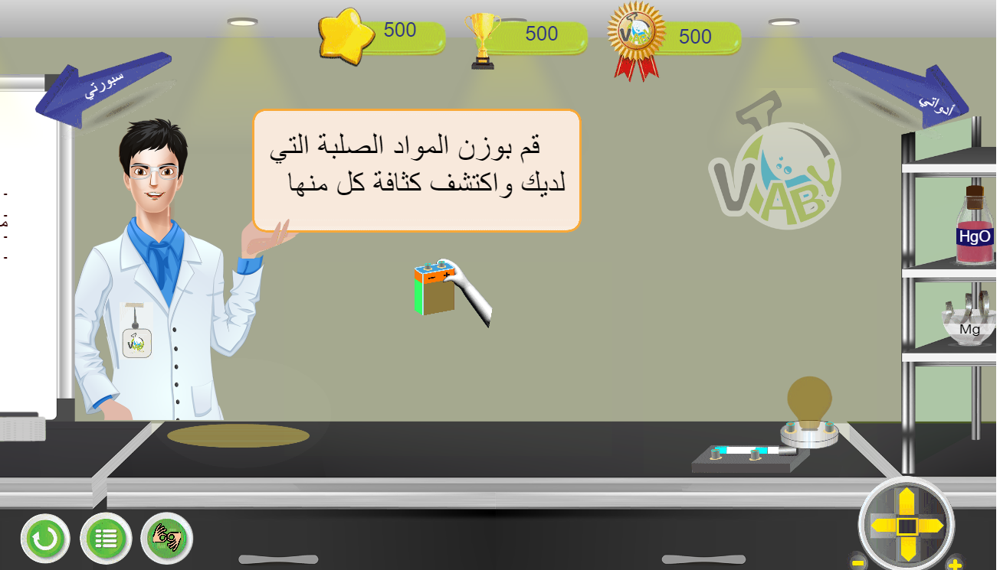
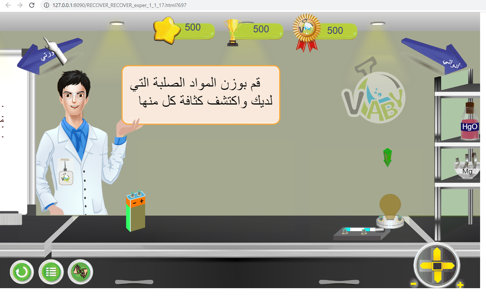

# Animation
Copy write (www.vlaby.com)

my task : 

don't know what is the just download adobe animation and then download RECOVER_RECOVER_exper_1_1_17.fla
and open it then click on (ctrl + p) 

my task from a to z (layer2 action2) 

using JavaScript, TweenJS , CreateJS, Jquery, and adobe animation 

I work with 2 situations with instructions and without instructions , my task all JS code needed and draw some ite

and control  arrow and steps

	
	
	

