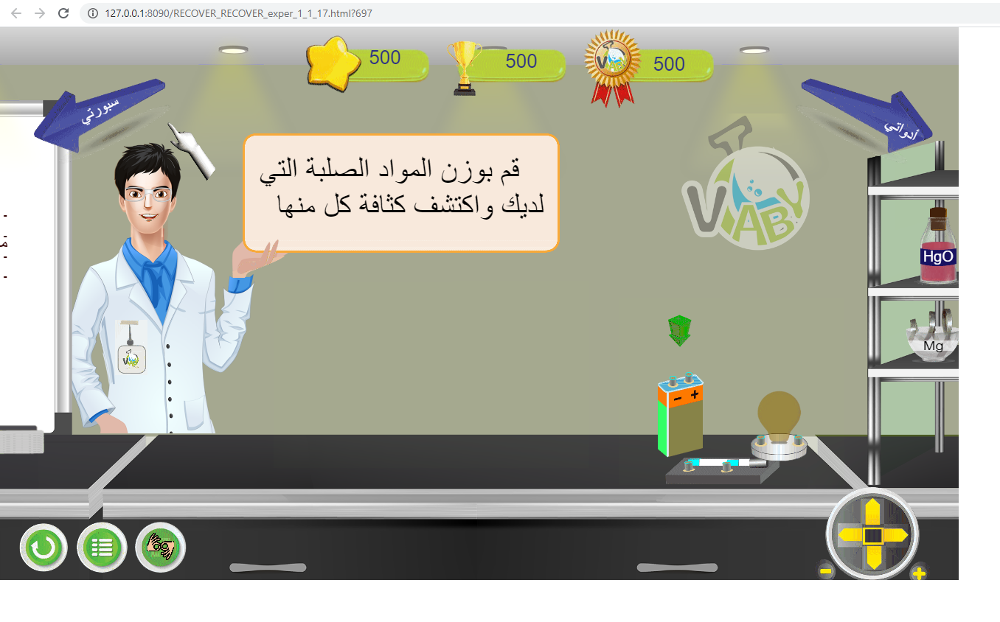

# Animation
Copy write (www.vlaby.com)

my task : 

don't know what is the just download adobe animation and then download RECOVER_RECOVER_exper_1_1_17.fla
and open it then click on (ctrl + p) 

my task from a to z (layer2 action2) 

using JavaScript, TweenJS , CreateJS, Jquery, and adobe animation 

I work with 2 situations with instructions and without instructions , my task all JS code needed and create some items
experiment not the settings and camera and score becuase they are fixed we are going to build more than 300 Experiment 

and control  arrow and steps sequence  

	
	
	

